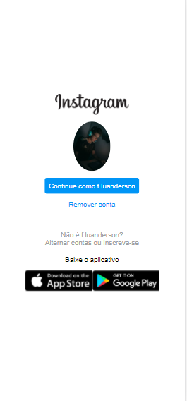
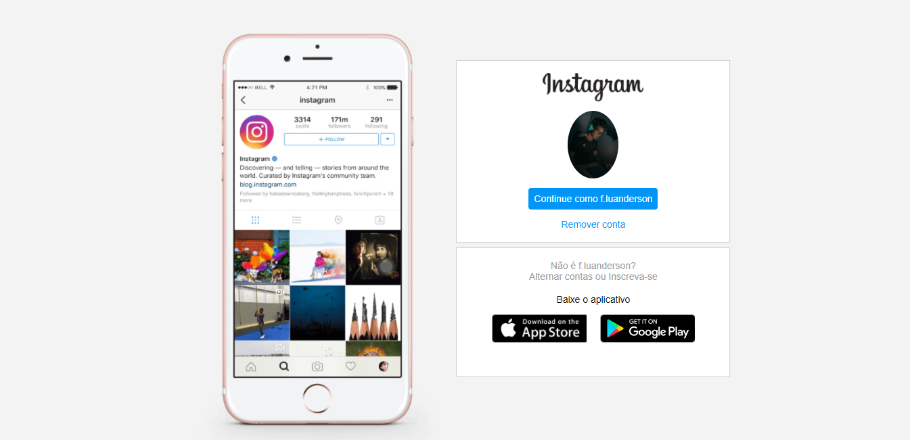

# Recriando-pagina-do-Instagram
Esse projeto foi um dos módulos presentes no Bootcamp da DIO para o projeto de estágio da AVANADE o #DECOLADEV e o intuito é concretizar o aprendizado de HTML 5 e CSS 3.

## Mobile:

## Desktop:

